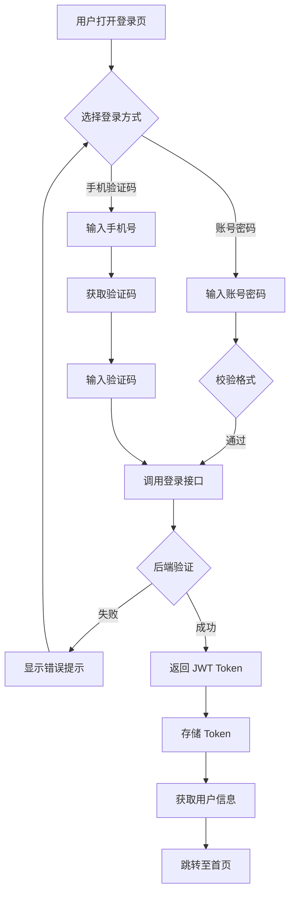
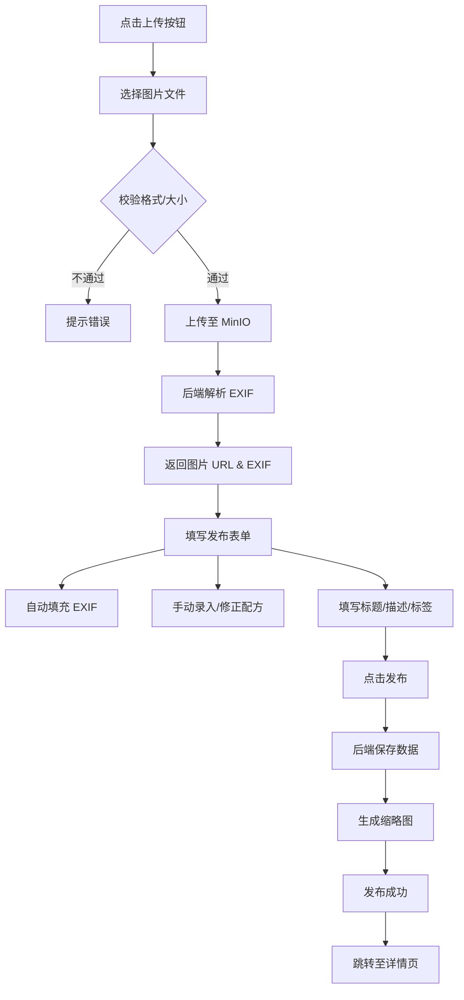
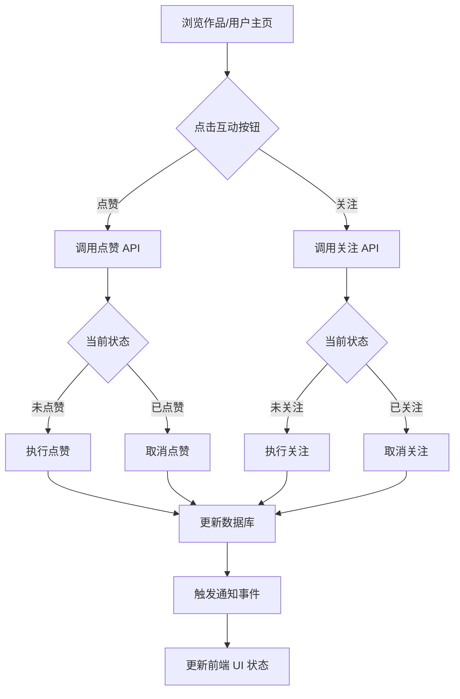
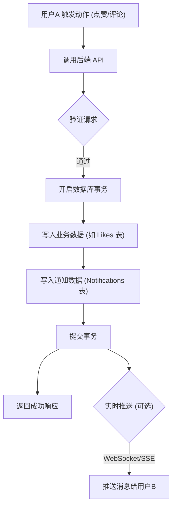
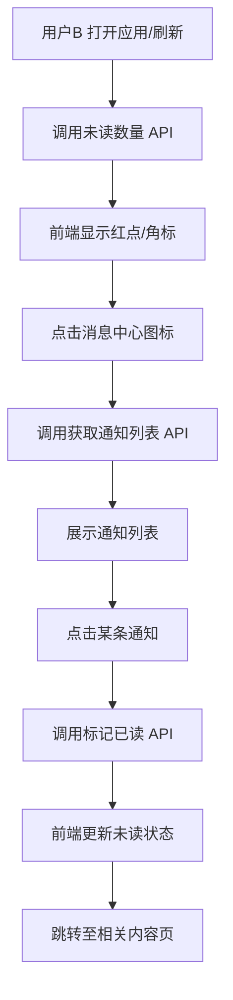

# Lumen Park - 产品设计文档

## 1. 产品概述
**Lumen Park** 是一个专注于分享“胶片配方”和技术细节的摄影社交平台。它主要面向摄影师，特别是富士（Fujifilm）相机用户，旨在让用户不仅能分享最终的照片，还能分享用于创作该照片的机内设置（即“配方”），从而实现风格的复刻与交流。

## 2. 核心功能

### 2.1 用户模块
- **注册/登录**：通过邮箱/手机号进行安全认证（JWT）。
- **个人主页**：头像、简介、器材清单（相机、镜头）、作品集、收藏夹。
- **社交关系**：关注/取消关注机制。
- **消息中心**：通知聚合与管理。

### 2.2 内容创作（“配方”帖子）
- **多图支持**：
  - 支持单次投稿上传一组图片（最多9张）。
  - **独立参数**：每张图片拥有独立的 EXIF 信息和富士配方参数。
  - **封面选择**：默认第一张为封面，用于首页展示。
- **图片上传**：
  - 支持高清 JPG/PNG/WEBP 格式。
  - **自动 EXIF 解析**：自动提取 ISO、光圈、快门速度（分数格式如 1/250）、焦距、相机型号、镜头型号。
- **富士配方参数录入**：
  - **胶片模拟 (Film Simulation)**：Provia, Velvia, Astia, Classic Chrome (经典正片), PRO Neg. Hi/Std, Classic Neg (经典负片), Eterna, Acros, Monochromatic (黑白), Sepia (怀旧) 等。
  - **动态范围 (Dynamic Range)**：DR100, DR200, DR400, DR-P, DR-Auto。
  - **白平衡 (White Balance)**：自动, 自定义 (1-3), 色温 (Kelvin), 日光, 阴影等。
  - **白平衡偏移 (WB Shift)**：红 (R) -9 到 +9, 蓝 (B) -9 到 +9。
  - **高光色调 (Highlight Tone)**：-2 到 +4。
  - **阴影色调 (Shadow Tone)**：-2 到 +4。
  - **色彩 (Color)**：-4 到 +4。
  - **锐度 (Sharpness)**：-4 到 +4。
  - **清晰度 (Clarity)**：-5 到 +5。
  - **颗粒效果 (Grain Effect)**：弱/强 (Weak/Strong), 小/大 (Small/Large)。
  - **色彩效果 (Color Chrome Effect)**：强/弱/关 (Strong/Weak/Off)。
  - **彩色 FX 蓝色 (Color Chrome FX Blue)**：强/弱/关 (Strong/Weak/Off)。

### 2.3 发现与互动
- **信息流 (Feed)**：展示最新/热门照片的瀑布流布局。
  - **展示信息**：
    - 封面图（如果是多图，显示多图标记）。
    - 作者头像与昵称。
    - **发布时间**：人性化显示（如“2小时前”、“昨天”、“2023年10月1日”）。
    - **互动数据**：浏览量、点赞量。
- **照片详情**：
  - **轮播展示**：多张图片支持左右切换浏览。
  - **参数联动**：切换图片时，右侧的 EXIF 信息和富士配方参数随之更新，显示当前图片对应的设置。
  - **配方面板**：专门的侧边栏/区域，以类似相机菜单的风格展示胶片模拟参数。
  - **“复制配方”**：一键将参数复制为文本格式。
- **互动**：点赞、评论、收藏。

## 3. 用户角色与权限

### 3.1 访客 (Guest)
- **权限**：
  - 浏览公开的信息流。
  - 查看照片详情和配方参数。
  - 搜索/筛选内容。
- **限制**：
  - 无法上传内容。
  - 无法点赞或评论。

### 3.2 摄影师 (Photographer - 注册用户)
- **权限**：
  - 拥有所有访客权限。
  - **上传**照片并创建配方。
  - **编辑/删除**自己的帖子。
  - **互动**：点赞、评论、关注。
  - **管理消息**：查看点赞/评论通知。
  - **管理个人资料**：更新头像、简介、器材清单。

### 3.3 管理员 (Admin)
- **权限**：
  - 拥有所有用户权限。
  - **内容审核**：删除不当帖子或评论。
  - **系统管理**：管理标签、发布系统公告。

## 4. 自动化 Agents (Automated Agents)

### 4.1 EXIF 解析 Agent
- **角色**：图片元数据提取器。
- **职责**：
  - 监听图片上传事件。
  - 从二进制流中解析标准 EXIF 数据（光圈、快门、ISO、相机型号）。
  - 尝试解析厂商私有 MakerNote 数据（如富士的胶片模拟模式）。
- **逻辑**：读取二进制头部 -> 映射到 Schema -> 填充 ExifData 表。

### 4.2 推荐 Agent (规划中)
- **角色**：个性化内容策展人。
- **职责**：
  - 分析用户的浏览、点赞和收藏行为。
  - 为用户生成个性化的“推荐”信息流。
- **逻辑**：基于内容标签匹配 (Content-based) 和协同过滤 (Collaborative Filtering) 算法。

### 4.3 图像处理 Agent
- **角色**：图片优化与生成器。
- **职责**：
  - 自动生成不同尺寸的缩略图 (Thumbnail, Medium, Large)。
  - 转换图片格式 (如转换为 WebP 以优化加载)。
  - (未来) 智能裁剪建议。

## 5. 用户流程图 (User Flows)

### 5.1 用户登录流程

### 5.2 作品上传流程

### 5.3 点赞/关注流程

## 6. 消息中心设计 (Message Center)

### 6.1 功能概述
消息中心用于聚合所有与用户相关的互动通知和系统公告，确保用户不错过任何重要信息。

### 6.2 通知类型
1.  **点赞通知 (Like)**
    *   触发条件：他人点赞了你的帖子。
    *   内容：用户头像 + 用户名 + "点赞了你的作品" + 作品缩略图。
    *   跳转：点击跳转至对应帖子详情页。
2.  **评论通知 (Comment)**
    *   触发条件：他人评论了你的帖子，或回复了你的评论。
    *   内容：用户头像 + 用户名 + "评论了你：" + 评论内容摘要。
    *   跳转：点击跳转至对应帖子详情页并定位到评论区。
3.  **关注通知 (Follow)**
    *   触发条件：他人关注了你。
    *   内容：用户头像 + 用户名 + "开始关注你了"。
    *   跳转：点击跳转至该用户的个人主页。
4.  **系统通知 (System)**
    *   触发条件：管理员发布公告或系统自动触发（如违规提醒）。
    *   内容：标题 + 内容摘要。
    *   跳转：点击查看完整公告或相关页面。

### 6.3 页面交互设计
*   **入口**：顶部导航栏右侧“铃铛”图标。
    *   **红点/数字角标**：显示未读消息总数（超过 99 显示 99+）。
*   **列表页**：
    *   **Tab 分类**：全部 | 点赞 | 评论 | 关注 | 系统。
    *   **未读状态**：未读消息背景高亮或有红点标记。
    *   **一键已读**：提供“全部标记为已读”按钮。
*   **操作**：
    *   点击单条消息：标记为已读并跳转。
    *   左滑（移动端）/ 更多菜单（PC）：删除通知。

### 6.4 消息通知流程图

**流程一：通知生成 (发送方)**

**流程二：通知获取与交互 (接收方)**

## 7. 页面设计概览

### 7. 页面设计概览

### 7.1 个人中心 (Personal Center)
详情请见 `docs/PERSONAL_CENTER_DESIGN.md`。
*   **功能**：展示用户头像、简介、统计数据（关注/粉丝/获赞），以及作品、喜欢、收藏列表。
    *   **Tab 切换**：
        *   **作品**：用户发布的帖子。
        *   **喜欢**：用户点赞过的帖子。
        *   **收藏**：用户收藏的帖子。
*   **编辑**：支持修改头像（本地上传）、昵称、简介。

### 7.2 投稿页面 (Submission Page)
详情请见 `docs/SUBMISSION_PAGE_DESIGN.md`。
*   **功能**：图片拖拽上传（自动解析 EXIF）、基本信息录入、富士配方参数录入（模拟相机菜单 UI）。

### 7.3 帖子详情页 (Post Detail Page)
详情请见 `docs/POST_DETAIL_DESIGN.md`。
*   **布局**：左侧**固定图片区**，右侧**独立滚动信息区**（包含配方、评论）。
*   **信息**：展示作者信息、完整作品描述、**可视化的富士配方参数表（中文化）**、**图标化的 EXIF 参数**。
*   **数据同步**：
    *   **实时性**：进入详情页时，自动同步最新的**点赞数**、**评论数**以及**当前用户的点赞状态**。
    *   **浏览量**：用户进入详情页即视为一次有效浏览，浏览量自动+1。
*   **互动**：
    *   **关注**：关注作者。
    *   **点赞**：点赞作品（爱心图标，点赞后变红）/评论。
    *   **收藏**：收藏作品（书签图标，收藏后变黄）。
    *   **评论**：
        *   支持无限层级回复（Nested Comments）。
        *   **权限**：
            *   任何人（登录后）均可发表评论或回复。
            *   **删除**：仅作品作者（Owner）有权删除该作品下的任何评论/回复。
    *   **分享**：复制链接。

### 7.4 首页 (Home Page)
详情请见 `docs/HOME_PAGE_DESIGN.md`。
*   **布局**：全屏多列响应式瀑布流。
*   **功能**：
    *   **滚动刷新 (Infinite Scroll)**：自动加载更多内容。
    *   **卡片展示**：仅显示封面图、标题、作者头像/昵称。
    *   **数据展示**：
        *   **浏览量**：显示眼睛图标及数量。
        *   **点赞量**：显示爱心图标及数量。
    *   **多图支持**：多图投稿显示多图标记。
