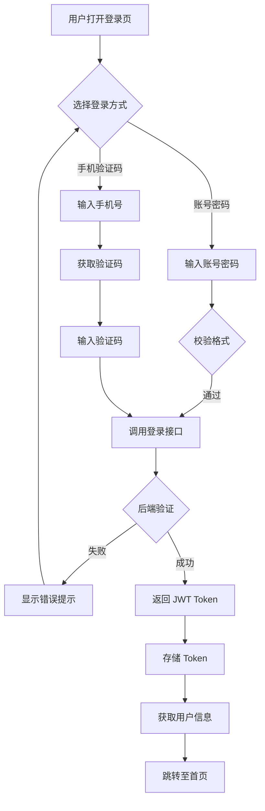
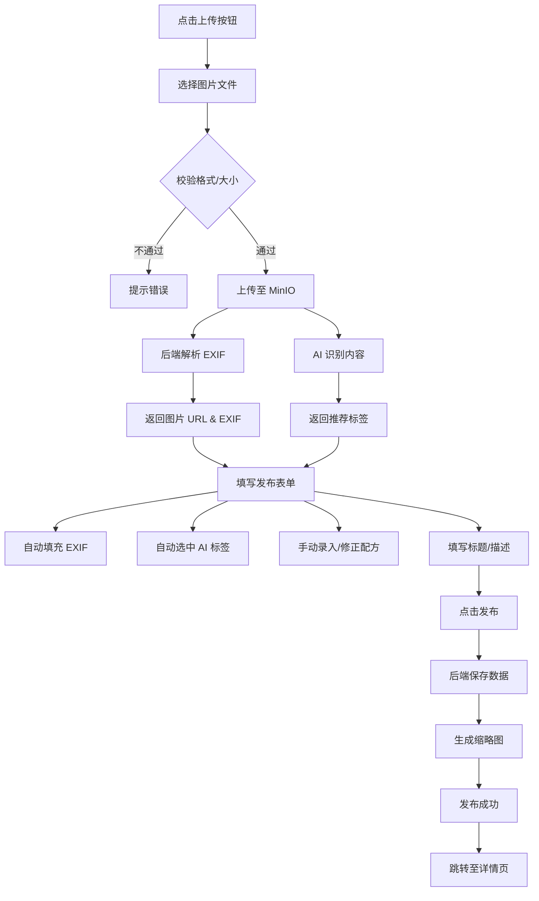
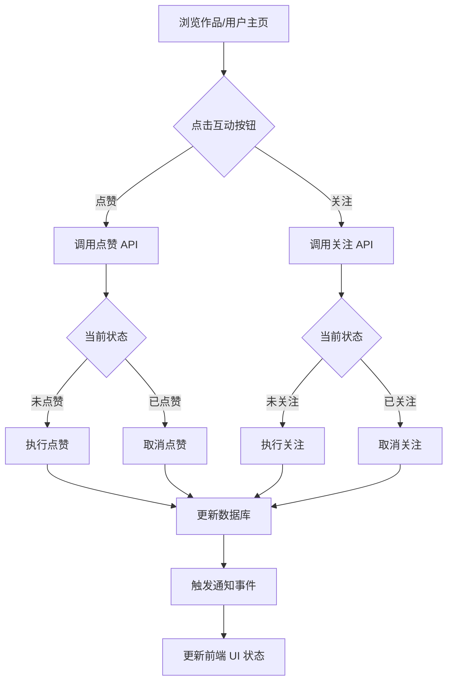
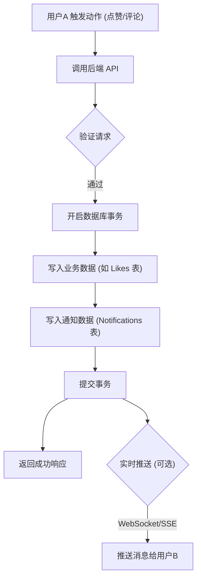
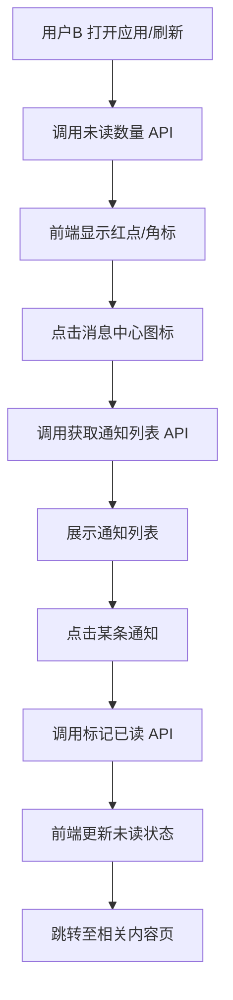

# Lumen Park - 产品设计文档

## 1. 产品概述
**Lumen Park** 是一个专注于分享“胶片配方”和技术细节的摄影社交平台。它主要面向摄影师，特别是富士（Fujifilm）相机用户，旨在让用户不仅能分享最终的照片，还能分享用于创作该照片的机内设置（即“配方”），从而实现风格的复刻与交流。

## 2. 核心功能

### 2.1 用户模块
- **注册/登录**：通过邮箱/手机号进行安全认证（JWT）。
- **个人主页**：头像、简介、器材清单（相机、镜头）、作品集、收藏夹。
- **社交关系**：关注/取消关注机制。
    - **关注/粉丝列表**：专门的列表页，支持查看、回关、取关等操作。
- **消息中心**：通知聚合与管理。

### 2.2 内容创作（“配方”帖子）
- **多图支持**：
  - 支持单次投稿上传一组图片（最多9张）。
  - **独立参数**：每张图片拥有独立的 EXIF 信息和富士配方参数。
  - **封面选择**：默认第一张为封面，用于首页展示。
- **图片上传**：
  - 支持高清 JPG/PNG/WEBP 格式。
  - **自动 EXIF 解析**：自动提取 ISO、光圈、快门速度（分数格式如 1/250）、焦距、相机型号、镜头型号。
  - **AI 智能标签推荐**：利用本地部署的 CLIP 模型，自动识别图片内容（如“阴天”、“海边”、“猫”）并推荐标签。
- **富士配方参数录入**：
  - **胶片模拟 (Film Simulation)**：Provia, Velvia, Astia, Classic Chrome (经典正片), PRO Neg. Hi/Std, Classic Neg (经典负片), Eterna, Acros, Monochromatic (黑白), Sepia (怀旧) 等。
  - **动态范围 (Dynamic Range)**：DR100, DR200, DR400, DR-P, DR-Auto。
  - **白平衡 (White Balance)**：自动, 自定义 (1-3), 色温 (Kelvin), 日光, 阴影等。
  - **白平衡偏移 (WB Shift)**：红 (R) -9 到 +9, 蓝 (B) -9 到 +9。
  - **高光色调 (Highlight Tone)**：-2 到 +4。
  - **阴影色调 (Shadow Tone)**：-2 到 +4。
  - **色彩 (Color)**：-4 到 +4。
  - **锐度 (Sharpness)**：-4 到 +4。
  - **清晰度 (Clarity)**：-5 到 +5。
  - **颗粒效果 (Grain Effect)**：弱/强 (Weak/Strong), 小/大 (Small/Large)。
  - **色彩效果 (Color Chrome Effect)**：强/弱/关 (Strong/Weak/Off)。
  - **彩色 FX 蓝色 (Color Chrome FX Blue)**：强/弱/关 (Strong/Weak/Off)。
- **标签系统**：
  - **分组快捷选择**：提供“光线”、“地点”、“主题”三个维度的预设标签，支持点击快速选择。
  - **自定义标签**：支持用户输入任意标签，系统自动归类为“其他”。

### 2.3 发现与互动
- **信息流 (Feed)**：展示最新/热门照片的瀑布流布局。
  - **筛选功能**：
    - **两级导航**：一级为维度（全部/光线/地点/主题），二级为横向滚动的具体标签。
    - **多维筛选**：支持同时选中多个标签进行组合筛选。
  - **展示信息**：
    - 封面图（如果是多图，显示多图标记）。
    - 作者头像与昵称。
    - **互动数据**：浏览量、点赞量。
- **照片详情**：
  - **轮播展示**：多张图片支持左右切换浏览。
  - **参数联动**：切换图片时，右侧的 EXIF 信息和富士配方参数随之更新，显示当前图片对应的设置。
  - **配方面板**：专门的侧边栏/区域，以类似相机菜单的风格展示胶片模拟参数。
  - **“复制配方”**：一键将参数复制为文本格式。
- **互动**：点赞、评论、收藏。

## 3. 用户角色与权限

### 3.1 访客 (Guest)
- **权限**：
  - 浏览公开的信息流。
  - 查看照片详情和配方参数。
  - 搜索/筛选内容。
- **限制**：
  - 无法上传内容。
  - 无法点赞或评论。

### 3.2 摄影师 (Photographer - 注册用户)
- **权限**：
  - 拥有所有访客权限。
  - **上传**照片并创建配方。
  - **编辑/删除**自己的帖子。
  - **互动**：点赞、评论、关注。
  - **管理消息**：查看点赞/评论通知。
  - **管理个人资料**：更新头像、简介、器材清单。

### 3.3 管理员 (Admin)
- **权限**：
  - 拥有所有用户权限。
  - **内容审核**：删除不当帖子或评论。
  - **系统管理**：管理标签、发布系统公告。

## 4. 自动化 Agents (Automated Agents) - 功能视角

### 4.1 EXIF 解析 Agent
- **角色**：图片元数据提取器。
- **职责**：
  - 监听图片上传事件。
  - 从二进制流中解析标准 EXIF 数据（光圈、快门、ISO、相机型号）。
  - 尝试解析厂商私有 MakerNote 数据（如富士的胶片模拟模式）。
- **逻辑**：读取二进制头部 -> 映射到 Schema -> 填充 ExifData 表。

### 4.2 AI 标签识别 Agent
- **角色**：智能内容分析师。
- **职责**：
  - 在图片上传时，调用本地 CLIP 模型。
  - 识别图片中的场景（如“阴天”）、地点（如“咖啡厅”）和主体（如“猫”）。
  - 返回推荐标签给前端，辅助用户快速填选。
- **技术**：基于 `openai/clip-vit-base-patch32` 模型，Zero-shot 分类。

### 4.3 推荐 Agent (规划中)
- **角色**：个性化内容策展人。
- **职责**：
  - 分析用户的浏览、点赞和收藏行为。
  - 为用户生成个性化的“推荐”信息流。
- **逻辑**：基于内容标签匹配 (Content-based) 和协同过滤 (Collaborative Filtering) 算法。

### 4.4 图像处理 Agent
- **角色**：图片优化与生成器。
- **职责**：
  - 自动生成不同尺寸的缩略图 (Thumbnail, Medium, Large)。
  - 转换图片格式 (如转换为 WebP 以优化加载)。
  - (未来) 智能裁剪建议。

## 5. 用户流程图 (User Flows)

### 5.1 用户登录流程

```mermaid
graph TD
    A["用户打开登录页"] --> B{"选择登录方式"}
    B -->|"账号密码"| C["输入账号密码"]
    B -->|"手机验证码"| D["输入手机号"]
    
    C --> E{"校验格式"}
    D --> F["获取验证码"]
    F --> G["输入验证码"]
    
    E -->|"通过"| H["调用登录接口"]
    G --> H
    
    H --> I{"后端验证"}
    I -->|"失败"| J["显示错误提示"]
    J --> B
    
    I -->|"成功"| K["返回 JWT Token"]
    K --> L["存储 Token"]
    L --> M["获取用户信息"]
    M --> N["跳转至首页"]
```

### 5.2 作品上传流程

```mermaid
graph TD
    A["点击上传按钮"] --> B["选择图片文件"]
    B --> C{"校验格式/大小"}
    C -->|"不通过"| D["提示错误"]
    C -->|"通过"| E["上传至 MinIO"]
    
    E --> F["后端解析 EXIF"]
    E --> G["AI 识别内容"]
    
    F --> H["返回图片 URL & EXIF"]
    G --> I["返回推荐标签"]
    
    H --> J["填写发布表单"]
    I --> J
    
    J --> K["自动填充 EXIF"]
    J --> L["自动选中 AI 标签"]
    J --> M["手动录入/修正配方"]
    J --> N["填写标题/描述"]
    
    N --> O["点击发布"]
    O --> P["后端保存数据"]
    P --> Q["生成缩略图"]
    Q --> R["发布成功"]
    R --> S["跳转至详情页"]
```

### 5.3 点赞/关注流程

```mermaid
graph TD
    A["浏览作品/用户主页"] --> B{"点击互动按钮"}
    B -->|"点赞"| C["调用点赞 API"]
    B -->|"关注"| D["调用关注 API"]
    
    C --> E{"当前状态"}
    D --> F{"当前状态"}
    
    E -->|"未点赞"| G["执行点赞"]
    E -->|"已点赞"| H["取消点赞"]
    
    F -->|"未关注"| I["执行关注"]
    F -->|"已关注"| J["取消关注"]
    
    G --> K["更新数据库"]
    H --> K
    I --> K
    J --> K
    
    K --> L["触发通知事件"]
    L --> M["更新前端 UI 状态"]
```

## 6. 消息中心设计 (Message Center)

### 6.1 功能概述
消息中心用于聚合所有与用户相关的互动通知和系统公告，确保用户不错过任何重要信息。

### 6.2 通知类型
1.  **点赞通知 (Like)**
    *   触发条件：他人点赞了你的帖子。
    *   内容：用户头像 + 用户名 + "点赞了你的作品" + 作品缩略图。
    *   跳转：点击跳转至对应帖子详情页。
2.  **评论通知 (Comment)**
    *   触发条件：他人评论了你的帖子，或回复了你的评论。
    *   内容：用户头像 + 用户名 + "评论了你：" + 评论内容摘要。
    *   跳转：点击跳转至对应帖子详情页并定位到评论区。
3.  **关注通知 (Follow)**
    *   触发条件：他人关注了你。
    *   内容：用户头像 + 用户名 + "开始关注你了"。
    *   跳转：点击跳转至该用户的个人主页。
4.  **系统通知 (System)**
    *   触发条件：管理员发布公告或系统自动触发（如违规提醒）。
    *   内容：标题 + 内容摘要。
    *   跳转：点击查看完整公告或相关页面。

### 6.3 页面交互设计
*   **入口**：顶部导航栏右侧“铃铛”图标。
    *   **红点/数字角标**：显示未读消息总数（超过 99 显示 99+）。
*   **列表页**：
    *   **Tab 分类**：全部 | 点赞 | 评论 | 关注 | 系统。
    *   **未读状态**：未读消息背景高亮或有红点标记。
    *   **一键已读**：提供“全部标记为已读”按钮。
*   **操作**：
    *   点击单条消息：标记为已读并跳转。
    *   左滑（移动端）/ 更多菜单（PC）：删除通知。

### 6.4 消息通知流程图

**流程一：通知生成 (发送方)**

```mermaid
graph TD
    A["用户A 触发动作 (点赞/评论)"] --> B["调用后端 API"]
    B --> C{"验证请求"}
    C -->|"通过"| D["开启数据库事务"]
    D --> E["写入业务数据 (如 Likes 表)"]
    E --> F["写入通知数据 (Notifications 表)"]
    F --> G["提交事务"]
    G --> H["返回成功响应"]
    
    G --> I{"实时推送 (可选)"}
    I -->|"WebSocket/SSE"| J["推送消息给用户B"]
```

**流程二：通知获取与交互 (接收方)**

```mermaid
graph TD
    A["用户B 打开应用/刷新"] --> B["调用未读数量 API"]
    B --> C["前端显示红点/角标"]
    
    C --> D["点击消息中心图标"]
    D --> E["调用获取通知列表 API"]
    E --> F["展示通知列表"]
    
    F --> G["点击某条通知"]
    G --> H["调用标记已读 API"]
    H --> I["前端更新未读状态"]
    I --> J["跳转至相关内容页"]
```

## 7. 页面详细设计

### 7.1 首页 (Home Page)

#### 7.1.1 概述
首页是用户探索和发现内容的中心。通过**瀑布流 (Waterfall Layout)** 布局和 **滚动刷新 (Infinite Scroll)** 机制，提供沉浸式的内容浏览体验。

#### 7.1.2 页面布局
- **导航栏 (Top Nav)**：固定在顶部，包含Logo、搜索、投稿入口、用户头像等。
- **内容区域 (Content)**：全屏宽度的瀑布流容器。

#### 7.1.3 核心功能
- **瀑布流展示**
  - **布局方式**：采用 **JS 控制的 Masonry 布局**（Mobile: 2列, Tablet: 3列, Desktop: 4列）。
    - **特点**：确保图片从左至右、从上至下均匀填充，避免 CSS Columns 造成的列间高度差异过大或底部留白问题。
  - **图片卡片**：
    - **封面图**：展示作品的封面（如果是多图，显示多图标记）。
    - **信息展示**：
      - **标题**：限制显示的行数（如2行），超出显示省略号。
      - **用户信息**：头像 + 昵称。
      - **互动数据**：仅展示 **浏览量 (Views)** 和 **点赞量 (Likes)**。
        - **不展示**：发布时间、评论数等其他信息，以保持界面简洁，聚焦视觉内容。
- **滚动刷新 (Infinite Scroll)**
  - **触发机制**：当用户滚动到页面底部（距离底部一定阈值，如200px）时，自动加载下一页内容。
  - **加载状态**：
    - **加载中**：底部显示 Loading 动画。
    - **加载完成**：追加新内容到列表末尾。
    - **无更多内容**：显示“没有更多了”提示。
  - **分页策略**：后端接口支持 `skip` 和 `limit` 参数，每次加载 20 条数据。

#### 7.1.4 UI/UX 细节
- **图片加载**：使用懒加载 (Lazy Load) 技术，提升首屏速度。
- **过渡动画**：新加载的卡片通过淡入 (Fade In) 动画出现。
- **悬停效果**：鼠标悬停在卡片上时，图片轻微放大或阴影加深，增强点击欲望。

#### 7.1.5 首页筛选区 UI 优化设计方案
- **设计目标**：
  - **去容器化 (De-containerization)**：移除显式的外边框，利用留白划分区域，使界面更现代、通透。
  - **层级清晰**：将“分类维度”（光线/地点等）提升为一级导航，将具体“标签”作为二级筛选。
  - **交互优化**：引入横向滚动交互，容纳更多标签的同时保持页面整洁。
  - **风格统一**：深度融合 Sage Green (鼠尾草绿) 主题，使用柔和的圆角和微阴影。
- **详细设计**：
  - **第一行（一级维度）**：左对齐或居中的 Tab 切换栏。
    - 选项：全部 | ✨ 光线 | 📍 地点 | 📷 主题
    - 样式：文本标签，选中时文字加粗并带有底部指示条（或背景胶囊）。
  - **第二行（二级标签）**：横向滚动的标签容器。
    - 样式：胶囊形 (Pill-shaped) 标签。
    - 交互：支持鼠标拖拽或触摸滑动，两端带有白色渐变遮罩提示滚动。

### 7.2 帖子详情页 (Post Detail Page)

#### 7.2.1 概述
帖子详情页是内容消费的核心页面，承载了高清图片展示、参数信息查阅以及用户互动功能。

#### 7.2.2 页面布局 (Layout)
采用 **左右分栏布局**（Desktop），在 Mobile 端自动转为上下布局。
- **顶部导航栏 (Top Nav)**：固定在页面顶部，不随页面滚动。
- **左侧：图片展示区 (Image Viewer)**
  - **固定定位 (Sticky)**：在 Desktop 模式下，当右侧内容滚动时，左侧图片区域保持固定不动，确保用户随时能看到作品。
  - **自适应**：图片在容器内完整展示 (`object-fit: contain`)。
  - **多图交互**：支持左右箭头切换；底部显示分页指示点；切换图片时，右侧参数区域同步更新。
- **右侧：信息与互动区 (Info & Interaction)**
  - **独立滚动**。高度铺满屏幕剩余空间，内容超出时内部滚动。
  - **模块顺序**：
    1.  **作者栏**：头像、昵称、关注按钮。
    2.  **作品信息**：标题、发布时间、描述文本。
    3.  **富士配方卡片 (Recipe Card)**：模拟相机菜单的深色 UI，所有参数名称和枚举值均显示为中文。
    4.  **EXIF 信息栏**：图标化展示相机、镜头、光圈、快门、ISO、焦距。
    5.  **评论区 (Comments)**：多级评论（两层结构），支持发表、回复、点赞。
    6.  **底部操作栏 (Action Bar)**：点赞、评论、分享。

#### 7.2.3 核心交互逻辑
- **关注 (Follow)**：前端需实时更新按钮状态。
- **点赞 (Like)**：点击后立即切换图标状态（空心/实心红心），实时 +1 或 -1。
- **评论 (Comment)**：支持无限层级回复（Nested Comments），仅作品作者有权删除。
- **分享 (Share)**：点击分享图标，将当前页面 URL 复制到剪贴板。

### 7.3 个人中心 (Personal Center)

#### 7.3.1 概述
个人中心是用户展示自我、管理内容和查看互动数据的核心页面。它需要清晰地展示用户信息、作品集以及收藏的内容，同时提供编辑资料的入口。

#### 7.3.2 页面布局
页面整体采用 **Header + Tabs + Content** 的结构。
- **头部区域 (Profile Header)**：
  - **背景图/Banner**（可选）。
  - **用户基本信息**：头像、用户名/昵称、简介 (Bio)。
  - **数据概览**：关注数 (Following)、粉丝数 (Followers)、获赞数 (Likes Received)。
  - **操作按钮**：编辑资料（本人） / 关注、私信（他人）。
- **内容标签页 (Tabs)**：
  1.  **作品 (Works/Posts)**：用户发布的所有照片/配方。
  2.  **喜欢 (Likes)**：用户点赞过的帖子。
  3.  **收藏 (Collections)**：用户收藏的帖子。
  4.  **关于/器材 (About/Gear)**：详细的个人介绍和常用的相机/镜头清单。

#### 7.3.3 详细功能模块
- **资料编辑 (Edit Profile)**：修改头像（本地上传）、昵称、简介、器材清单。
- **作品展示 (Works Gallery)**：复用首页的**瀑布流布局**。
- **喜欢与收藏 (Likes & Collections)**：同样采用瀑布流布局，支持隐私控制。
- **关注/粉丝列表 (Follows)**：点击关注数或粉丝数时，弹出模态框展示列表。

### 7.4 投稿页面 (Submission Page)

#### 7.4.1 概述
投稿页面是用户分享摄影作品和胶片配方的入口。设计的核心目标是**简化复杂的参数录入过程**，通过自动化解析 EXIF 数据来减少用户负担，同时提供直观的配方编辑界面。

#### 7.4.2 页面流程
1.  **上传图片**：用户拖拽或点击上传一组图片（最多9张）。
2.  **列表编辑**：显示图片缩略图列表，点击某张图片，右侧显示该图片的详细参数表单。
3.  **智能解析**：系统自动读取每张图片的 EXIF 信息。
4.  **参数录入**：用户可以为每张图片单独设置配方，支持“应用到所有”功能。
5.  **补充信息**：填写整个帖子的标题、描述、标签。
6.  **发布**：提交至服务器。

#### 7.4.3 详细功能模块
- **图片上传区域 (Image Uploader)**：支持多选上传，拖拽排序，删除。
- **参数编辑区 (右侧/下方)**：EXIF 数据、富士配方。
- **基本信息 (Basic Info)**：标题、描述、标签。
- **富士配方 (Fujifilm Recipe)**：胶片模拟、动态范围、颗粒效果、白平衡、高光/阴影、色彩、锐度、清晰度。
- **底部操作栏**：发布、存草稿、取消。

#### 7.4.4 标签交互优化
- **分组快捷标签 (Grouped Quick Tags)**：将推荐标签区域重构为三个独立的横向滚动区，分别对应 **光线 (Lighting)**、**地点 (Location)**、**主题 (Subject)**。
- **交互逻辑**：点选即中，高亮显示。
- **自定义补充**：保留自定义输入框，用于补充长尾标签。

## 8. 特性详细设计 (Features)

### 8.1 3D 展厅 (3D Gallery)
- **目标**：为Lumen Park摄影社交平台构建一个基于Three.js的沉浸式3D虚拟展厅，让用户能够以第一人称视角浏览影集作品，提供接近真实艺术展览的体验。
- **核心特性**：
  - **圆柱形展厅结构**：360度环绕式作品展示。
  - **第一人称视角**：FPS风格的漫游体验。
  - **智能布局系统**：根据作品数量动态调整展厅规模。
  - **专业画框渲染**：PBR材质和玻璃反射效果。
  - **多端适配**：支持桌面端鼠标、移动端触摸操作。

### 8.2 AI 智能标签推荐
- **核心理念**：为了进一步降低用户在投稿时的输入成本并提高标签的准确性，我们将引入 **AI 图像识别** 能力。当用户上传图片后，系统自动分析图片内容，识别出场景（Scene）、物体（Object）和光线（Lighting）特征，并**预选中**或**推荐**相应的标签。
- **业务流程**：
  1.  **上传阶段**：用户在前端选择图片 -> 上传到后端。后端触发异步任务。
  2.  **识别阶段**：后端调用 CLIP 模型，输入用户图片 + 预设标签库，计算相似度分数，筛选 Top-K 标签。
  3.  **反馈阶段**：上传接口返回响应时，带上 `suggested_tags` 字段。前端自动高亮选中或标记推荐标签。

### 8.3 场景与分类 (Scenes & Categories)
- **概述**：为了帮助用户更精准地查找和筛选富士胶片配方，引入 **“场景 (Scene)”** 和 **“分类 (Category)”** 的概念。
- **维度定义**：
  1. **环境/光线 (Environment/Lighting)** - 定义“场景”（如：阴天, 晴天, 室内, 夜景）。
  2. **主题/地点 (Subject/Location)** - 定义“分类”（如：人像, 街拍, 海边, 咖啡厅）。
- **组合逻辑**：用户可以通过“并集”或“交集”的方式组合标签进行筛选。

### 8.4 社交列表 (Social Lists)
- **概述**：完善个人中心的社交互动体验。当用户点击个人主页的“关注数”或“粉丝数”时，进入专门的列表页。
- **页面流程**：
  - **入口**：个人主页顶部的统计数据区。
  - **列表页**：展示用户卡片列表（头像、用户名、简介、操作按钮）。
  - **操作**：关注、取消关注、互相关注状态显示。
